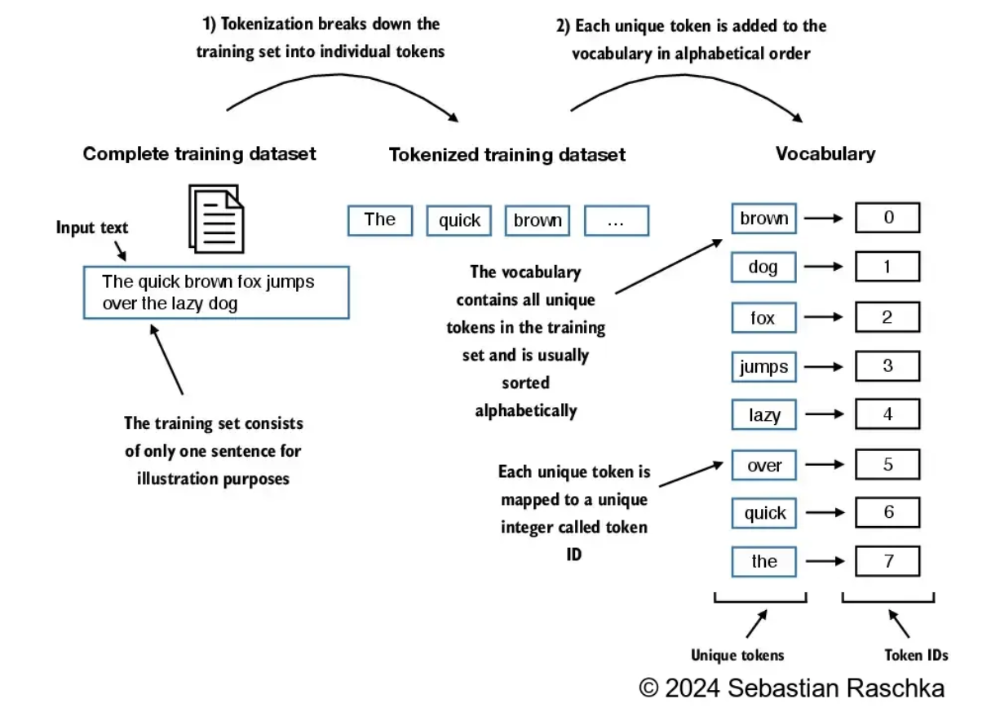

# Python Final Assignment 


## Overall Instructions
The overall assignment has two parts. In the first part you will create a vocabulary and in the second part you will develop a tokenizer class. 

Overall, all large language models or LLM (at least the textual ones) are trained with textual data. How can you input text into a computer and train LLMs?

There are multiple steps in training a large language models from scratch. The image below shows the required steps for training a LLM. The input in this image is `"So long and thanks for"` and the first step is called **Input Embeddings** which refers to transforming the string, text or input into high-dimensional vectors (or in simple terms, transforming the input text into complex numbers)


In this assignment, we will work on a task that happens before generating the **Input Embeddings**.

The image below shows that before obtaining the **Input Embeddings** or **Token Embeddings** we need to do two things:
1) tokenize our text
2) create token IDs.

Your assignment is to create python scripts that can automate this process.


Tokenization can be defined as the process of breaking text into smaller units, such as individual words and punctuation characters. For our assignment, we will break the text into whole words and punctuations. For instance, let's tokenize a question a doctor made to a patient:

Doctor's turn: 
` OK, and then any cancers in the family?`

Tokenized:
`['OK', ',', 'and', 'then', 'any', 'cancers', 'in', 'the', 'family', '?']`

As you can see everything inside the doctor's turn was tokenized. From a linguistics perspective, you tokenized everything that adds value to the meaning of a sentence. 

Another example:


*Random question for you, What is the value of tokenizing `'--'` in the previous example? If you are curious and have time, you can google the impact this token has on the syntax of a sentence. Would it be okay to ignore this token?*

After tokenization, you need to convert the tokenized text into token IDs. For this, you will create a **Token ID generator class**. This class needs to have two parts: 
- The `encode` function that turns text into token IDs
- The `decode` function that turns token IDs back into text.


Let's focus on the encoding section `tokenizer.encode(text)`. In this step, the sample text is tokenized into tokens (tokenization) and then transfromed into token IDs. If you carefully look at the image, you will find you need a "vocabulary" to make this last step happen. 

How do you create a vocabulary? It depends on the training dataset you are using to train your LLM. For instance, imagine your training data is all the information available in wikipedia. Then, you will create a python script that does 3 things:
1) reads everything from wikipedia
2) tokenize the input text
3) saves each token and its corresponding number into a dictionary. (See image below)


Once you have created a dictionary like the one above, you can start training your LLM. Let's look at the following image and imagine that the first sentence in your training dataset is `This is an example`. Your **Token ID generator class** by using your dictionary will transform the input text into Token IDs. 


## First part
Your job is to create a vocabulary from 270 patient-doctor mock conversations. The dataset was obtained from this [article](https://www.nature.com/articles/s41597-022-01423-1). (You do not need to read the article)

The conversations were already transcribed and saved into the "transcriptions" folder in this github repository. 

I will give you some guidance on how to clean your data. 

**REMINDER!**
You are not allowed to use the following packages:
- [Spacy](https://spacy.io/)
- [NLTK](https://www.nltk.org/)

### Cleaning data
I would highly recommend that you start working with one file. After successfully creating a dictionary for that file adapt your coding for multiple files. 


#### Deleting `D:` and `P:`

Imagine we choose two turns from the file named `CAR0001.txt`.

```
D: OK, and then any cancers in the family?

P: No.
```

Both `D: ` and `P: ` mean that each turn belongs to either a doctor or a patient. Because these do not hold any syntactic meaning in a given turn, we will eliminate these characters. 

The following examples uses the package [RegEx](https://www.w3schools.com/python/python_regex.asp) for python. RegEx means "Regular Expressions", a term that you will learn in the future. 

First, let's get rid of the `D: ` and `P: `. You can do this with the following code:

```python
#Let's imagine you have a list with two turns:
lst_turns = ["D: OK, and then any cancers in the family?", "P: No."]
new_lst = []
for turn in lst_turns:
    cleaned_turn = re.sub("^D: |^P: |^P; |^D; ", "", turn)
    new_lst.append(cleaned_turn)

print(new_lst)
new_lst = ["OK, and then any cancers in the family?", "No."]
```
*In ReGex, `re.sub()` is used for replacing or substituting. You do not need to know how it works. Just use this coding wherever is needed.*

Output:
```
OK, and then any cancers in the family?

No.
```


#### Splitting a sentence into tokens

Now the input will be:
```
OK, and then any cancers in the family?

No.
```

We need to split each line into tokens. For our assignment, every word and punctuation mark (i.e., comma, question, and period) is a token.

To do this, we will use a `re.split()` that splits a sentence based on prespecified values. Use the code below wherever is needed:

```python
# Imagine your input is just one turn. 
input = "OK, and then any cancers in the family?"
tokenized_turn = re.split(r'([,.?_!"()\']|--|\s)', input)

#Output
print(tokenized_turn)
['OK', ',', '', ' ', 'and', ' ', 'then', ' ', 'any', ' ', 'cancers', ' ', 'in', ' ', 'the', ' ', 'family', '?', '', '\n', '']  
# As you can see every part of sentence was split into tokens including the spaces.
# In order to ignore the spaces you need to do as follows:

final_lst = []
for item in tokenized_turn:
    if item.strip() != '':
        final_lst.append(item)

#Output
print(final_lst)
['OK', ',', 'and', 'then', 'any', 'cancers', 'in', 'the', 'family', '?']
```


### Creating your vocabulary
Create your vocabulary and save it as `vocabulary.txt`. 

Your `.txt` file should look like this:
```
Ibuprofen:470
If:471
Ii:472
Im:473
In:474
Including:475
India:476
Initially:477
Inorganic:478
Inwards:479
Is:480
Issues:481
It:482
Italy:483
Itchy:484
```
